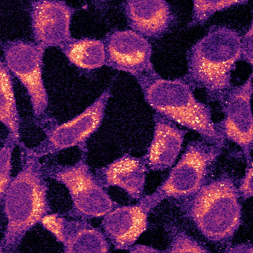
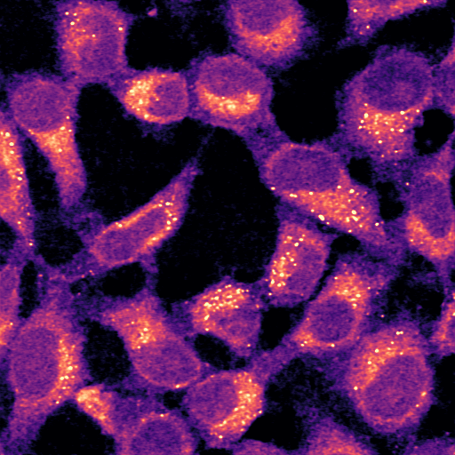

# Self-Supervised Denoising of Nonlinear Microscopy Images by UNet-based Blind Spot model (UNet-Transformer optional)

## Results

### Denoising Inference Results (Under Same Contrast)

<table>
  <tr>
    <th>Original</th>
    <th>Denoised</th>
  </tr>
  <tr>
    <td></td>
    <td></td>
  </tr>
</table>

## Preparing Training Dataset

The field of view of each image is 512 × 512 and the intensities of all images were normalized during the training.


## Installation

Install the package in editable mode for development:

```bash
pip install -e .
```

Or install with dependencies from `requirements.txt` first:

```bash
pip install -r requirements.txt
pip install -e .
```

Note: Installing PyTorch may require selecting the right extra index for your CUDA version. See https://pytorch.org/get-started/locally/ if the default wheel does not match your environment.

## Quick Start

### Simple Python Commands

For quick usage, you can directly run:

```bash
# Training
python train.py --data_dir ./data/train --val_dirs ./data/validation --n_epoch 200

# Inference
python infer.py --test_dir ./data/test --checkpoint ./ckpt/srs_epoch_200.pth --output_dir ./predict
```

### CLI Usage

After installation, the following commands are available:

- `selfdenoise-train`: runs the training entrypoint (same args as `python train.py`).
- `selfdenoise-infer`: runs inference on a folder of `.tif` images.

Examples:
```bash
# Train
selfdenoise-train --data_dir ./data/train --val_dirs ./data/validation --n_epoch 100

# Inference
selfdenoise-infer --test_dir ./data/test --checkpoint ./ckpt/checkpoint.pth --output_dir ./predict
```

## Acknowledgments

I would like to thank the authors of "Self-Supervised Image Denoising with Visible Blind Spots" for their strategies, which have significantly inspired and informed microscopy fields.

